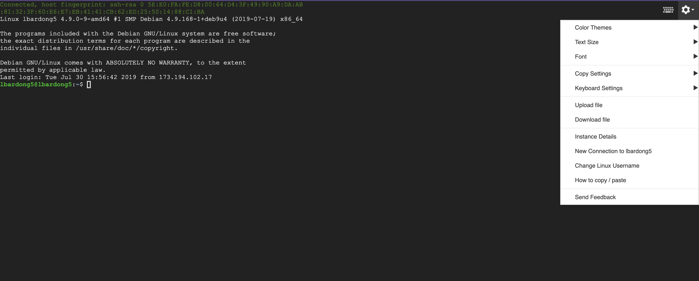

# bert_question_training

## Setting up Data
* Clean you data to have three .tsv files (train.tsv, test.tsv, dev.tsv)
* Each should have two columns with the two sentences
* The three files should be in the same directory

## Create a Google Cloud Project
* First create a google cloud project following the steps in this link
https://cloud.google.com/resource-manager/docs/creating-managing-projects

## Creating GC Storage Bucket
* Follow the instructions on this link
https://cloud.google.com/storage/docs/creating-buckets#storage-create-bucket-console
  * use the steps for **Console**
## Setting up the TPU VM
* Follow the instructions on this link
<https://cloud.google.com/tpu/docs/quickstart>

* Once you are set up ssh into the TPU VM instance and clone the bert repository using this command and clone this repository to the VM

`git clone https://github.com/google-research/bert.git `

* Then move `next_sentence_prediction.py` from this reposistory to the `bert` repository.

* run `sudo apt install emacs` so that you can edit the path for the data.

## Running the training model

*  Press the symbol at the top right of the screen and select upload file and download `train.tsv` , `dev.tsv` , and `test.tsv`  from your local directory.

## Parameters 
 * `--task_dir` Directory path to folder with train.tsv, dev.tsv, and test.tsv
 * `--bert_dir` Directory for BERT model that the BERT model was trained on.
 * `--output_dir` The output directory where the model checkpoints will be written
 * `--use_tpu` Whether to use TPU or GPU/CPU
 * `--tpu_name` The Cloud TPU to use for training. This should be name used creating the TPU
 * `tpu_address` Use grpc address. Example grpc://ip.address.of.tpu:8470
 * `--learning_rate` The initial learning rate for BERT
 * `--num_train_epochs`Total number of training epochs to perform
 * `--train_batch_size` Size of the training batch
 * `-eval_batch_size` Size of the evaluating batch
 * `--predict_batch_size` Size of the prediciting batch
 * `--max_seq_length` Maximum number of tokens in a sequence
 * `--num_train_steps` Number of training steps
 * `--do_lower_case` Applyinglower case or not
 
 An example of required parameters based on original bert repo https://github.com/google-research/bert for `run_pretraining.py`
 `
 python next_sentence_prediction.py \
   --input_file=/tmp/tf_examples.tfrecord \
   --output_dir=/tmp/pretraining_output \
   --do_train=True \
   --do_eval=True \
   --bert_config_file=$BERT_BASE_DIR/bert_config.json \
   --init_checkpoint=$BERT_BASE_DIR/bert_model.ckpt \
   --train_batch_size=32 \
   --max_seq_length=128 \
   --max_predictions_per_seq=20 \
   --num_train_steps=20 \
   --num_warmup_steps=10 \
   --learning_rate=2e-5
 `

 Talk about the output you get
